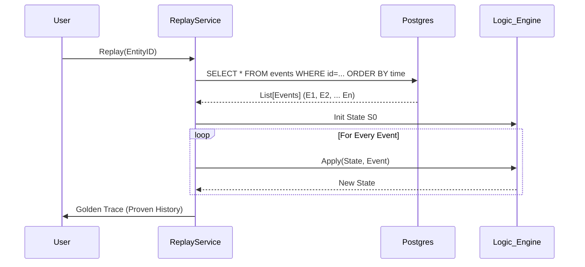

# Functional Workflows: A Technical Deep Dive

## 1. The Ingestion Workflow (The Hot Path)

This is the most performance-critical path in the system. It handles the intake of raw data and its conversion into a structured Event.

**Flow:**
1.  **Request:** User sends `POST /memory/ingest` with raw text or JSON.
2.  **Allocation:** The API Gateway requests a memory slab from the `SlabAllocator`.
3.  **Fast Write:** The raw bytes are written to Shared Memory. The API returns `202 Accepted` immediately.
4.  **Worker Pickup:** A background `worker_process` (in `ingest_service.py`) detects the "filled" slab.
5.  **Processing:**
    *   **Deserialization:** Bytes -> JSON.
    *   **Meta-Stability:** `check_drift()` and `check_integrity()` run to reject malformed thoughts.
    *   **TMS Creation:** `TMSService.create_event()` generates a UUID and calculates the initial `TruthVector`.
    *   **Derivation:** `StateDerivationService.apply_event()` calculates the new Entity State in-memory.
6.  **Transmission:** The Event and New State are pushed to the `PersistenceEngine` via ZeroMQ (`queue_manager.py`).

## 2. The Retrieval Workflow (Hybrid Search)

Retrieval is not a simple database lookup; it is a reconstruction of knowledge.

**Flow:**
1.  **Query:** User asks "What does Alice do?"
2.  **Vector Search (Recall):** The query is embedded (Vectors) and sent to Qdrant to find the top 100 semantically similar memories.
3.  **Graph Filtering (Precision):** (Phase 7) The results are filtered by graph constraints (e.g., "Must be related to entity 'Alice'").
4.  **Truth Ranking (Trust):**
    *   Each candidate memory has a `TruthVector`.
    *   Score = $C \times A \times F \times \log(R)$
    *   Low-confidence hallucinations are down-ranked.
5.  **Response:** The top N results are returned, sorted by "Cognitive Reality" rather than just similarity.

## 3. The Replay Workflow (Time Travel)

This is the "Crown Jewel" feature for debugging and correctness.

**Flow:**
1.  **Trigger:** Developer requests `capture_trace(entity_id)`.
2.  **Fetch History:** `ReplayService` queries Postgres for **all** events for that `object_id`, sorted strictly by `timestamp ASC`.
3.  **Simulation (The "Clean Room"):**
    *   An empty state $S_0$ is created.
    *   The loop runs: $S_{t+1} = \text{Derive}(S_t, E_t)$ for $t=0 \dots N$.
    *   This happens in memory, without side effects.
4.  **Verification:**
    *   The simulated final state $S_{final}$ is compared to the stored state in `entity_state`.
    *   If they differ by more than $\epsilon$ (1e-6), the system flags a "State Corruption."
5.  **Timewarp (Optional):** If a new event is inserted at $t=50$, the Replay Service re-runs the simulation from $t=50 \dots N$ to generate the correct new present state.

## 4. The Maintenance Workflow (Sleep Cycle)

This runs in the background (like sleep) to optimize storage.

**Flow:**
1.  **Decay:** The `DecayService` lowers the `freshness` score of events based on their age and access frequency.
2.  **Pruning:** Events with a Truth Score below a threshold (e.g., 0.1) are hard-deleted or archived.
3.  **Consolidation:** The `Assimilator` looks for clusters of events (using vector similarity) and merges them into a single "Summary Event."
    *   *Example:* "Run 1km", "Run 2km", "Run 3km" -> "Ran 6km total".
    *   The original detailed events are marked as `consolidated` (soft delete).
